# How to Run
To run one simulation and get state-space with time plots, RoA plot, and return map plot, modify `assignment_1.py` to setup your desired simulation and model parameters (`simulation_params` and `model_params`), and then run:  

```console
uv run python assignment_1.py
```
--

To run a sweep over inclinations and number of spokes, run  

```console
uv run python assignment_1_roa_simulate.py
```
and then run  
```console
uv run python assignment_1_roa_map.py
```
to see the results in graphical form along with RoA plots, return map plots and overall plots for the whole sweep for Floquet Multipliers against inclines and number of spokes. The results are saved to the path `assignment_1_results`.

# Process and Analysis

## Initial Sketches
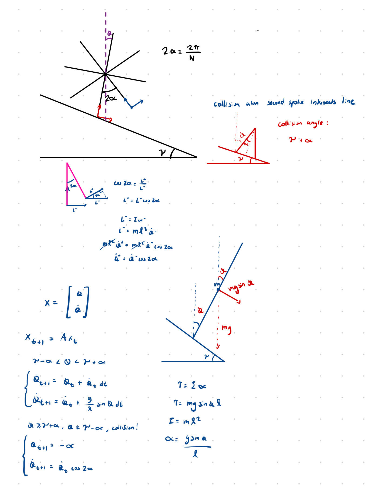

## Sanity Checks

The first sanity check I did was to test a few different inclines and start states to see if I could get simulations that either fully stopped or started to limit cycle.

*Test 1 (Converges to stop in unstable position, vertical)*  
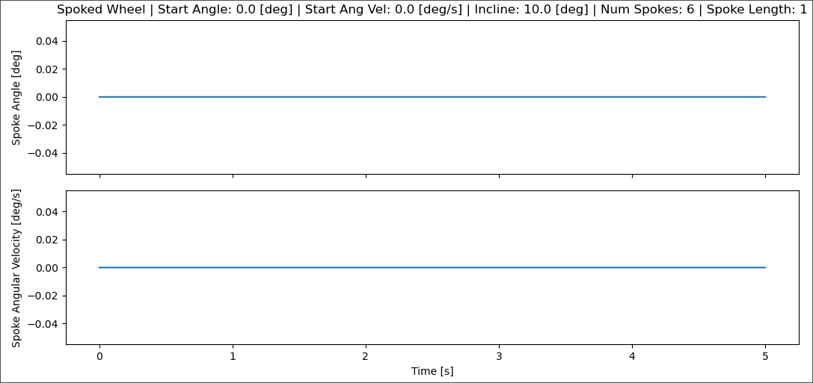
In this test, the spoke started perfectly vertical with no starting velocity, and so did not move at all and stayed at the vertical unstable equilibrium. This made sense to me.

*Test 2 (Converges to limit cycle)*  
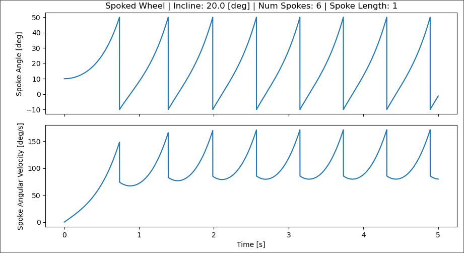
In this test, I started with the spoke at an angle so it was able to speed up and start to limit cycle. We can see the pre-collision velocity of the wheel increase over time until it starts cycling, and at each collision we see the post-collision velocity is $1/2$ of the pre-collision velocity, which makes sense since $\cos(2\alpha)$ here would be $1/2$.

*Test 3 (Converges to stop in stable position, both legs on ground)*  
I tested with a larger alpha to see if I could get the wheel to stop, but it exhibited some really weird behavior at first.
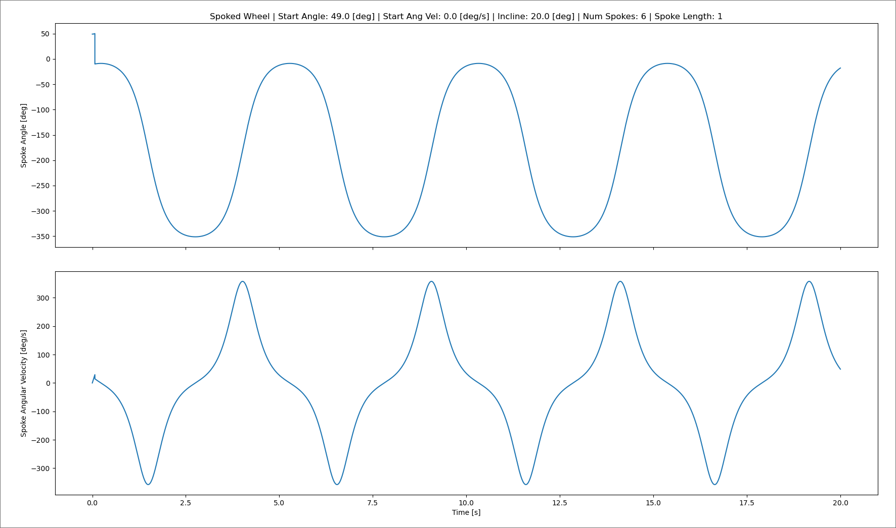

I then discovered that I forgot to handle the backwards collision case. Fixing it and adding some filtering on velocity to prevent continuously hyper-oscillating between both feet gave me this:  

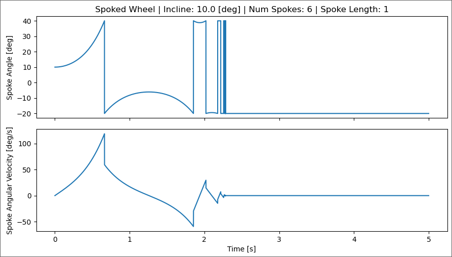

which makes much more sense. We can see the angle increase as the wheel moves down, and then when the first leg comes into contact the angle teleports to $\gamma - \alpha$ . This happens again the other way when we hit the starting leg, and then again and again until the velocity settles to 0.  

___
### Regions of Attraction

I tested over a initial state space from -500 deg/s to 300 deg/s and -10 deg to 50 deg ($\gamma-\alpha$ to $\gamma+\alpha$) (contact point from previous spoke to next spoke).  
  
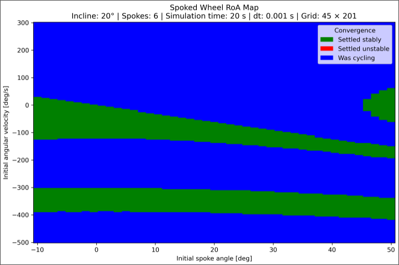

There are a few distinct regions.  
The right-top green region is where one of the legs is very close to the ground and and the starting velocity is low, so the spoked wheel settles in a resting position with two legs on the ground.  
The large top blue region is where the spoked wheel is able to gain enough momentum at the first collision to where it is able to keep gaining speed until it reaches a limit cycling velocity.  
The center green region is where the spoked wheel starts at a reasonable angle where it is able to jump over the first step but doesn't have enough momentum to keep going till limit cycle and eventually slows down to a stop.  
After this, there is one more region where the spoked wheel starts with enough velocity where it is able to go backwards a few steps, but depending on which angle it slows down to 0 at, it is either able to enter the top blue convergence region and ends up limit cycling or ends up in one of the green regions and ends up stopping.  

___
### Return Map

The left-most curve corresponds to the scenarios where angular velocity is negative enough to where the spoked wheel is able to move backwards and spin after one collision before it eventually settles to a stop at (0,0).  
The center line corresponds to scenarios where the angular velocity is low and so the spoked wheel shakes back and forth before settling to a stop.  
The right curve corresponds to where the angular velocity is high enough to where the spoked wheel settles to a stable velocity at which it limit cycles.  

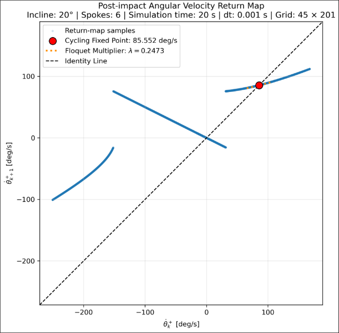

___
### Effect of Slope and Num Spokes on Local Convergence

#### Trying Different Incline Angles
I tested incline angles at every 3 degrees from 0 to 90 degrees. This plot shows the Floquet Multipliers with respect to the slope inclinations (did not include very low inclinations because there was no limit cycling at all).  
The incline angle doesn't actually seem to have an effect on the multiplier. Intuitively, I thought that a higher slope would cause the spoked wheel to start accelerating faster and settle to a limit cycle faster. However, the multiplier describes how many collisions it takes for the system to converge to a limit cycle, and as we increase the inclination we increase the rate of collisions and so converge to limit cycle faster but from the perspective of the Poincare Section at collision points it takes the same number of collisions to converge.  
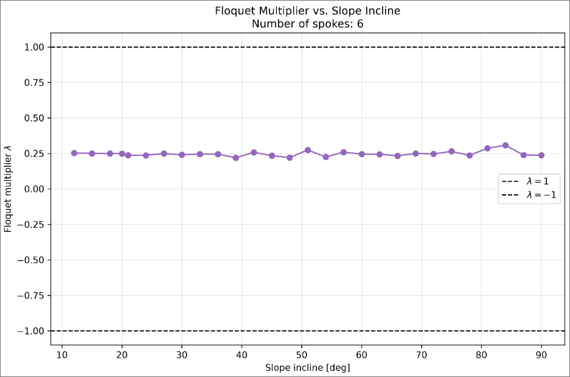

Looking at some RoA graphs at different inclines, we can see that the regions that converge to a stop shrink as the incline increases! :   
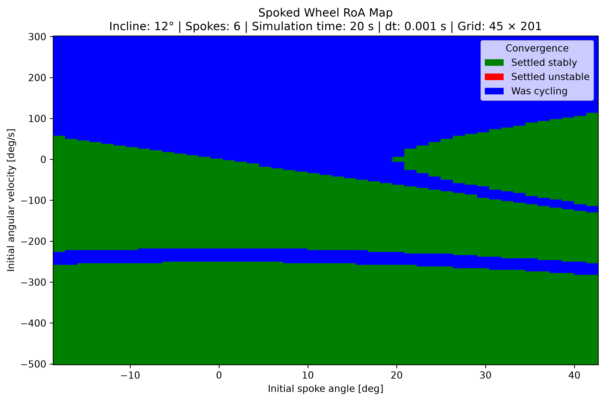
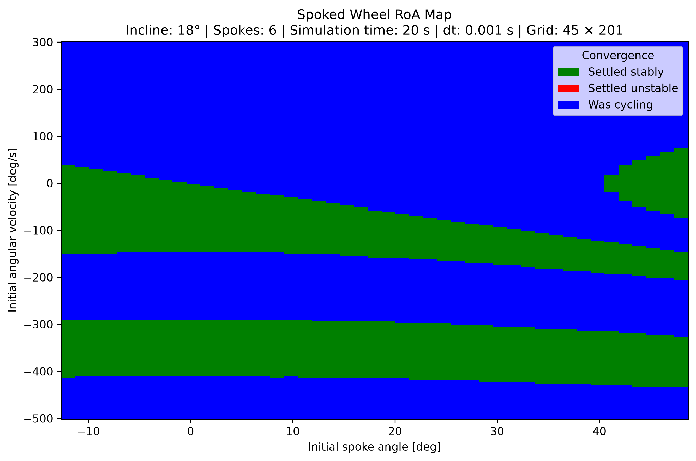

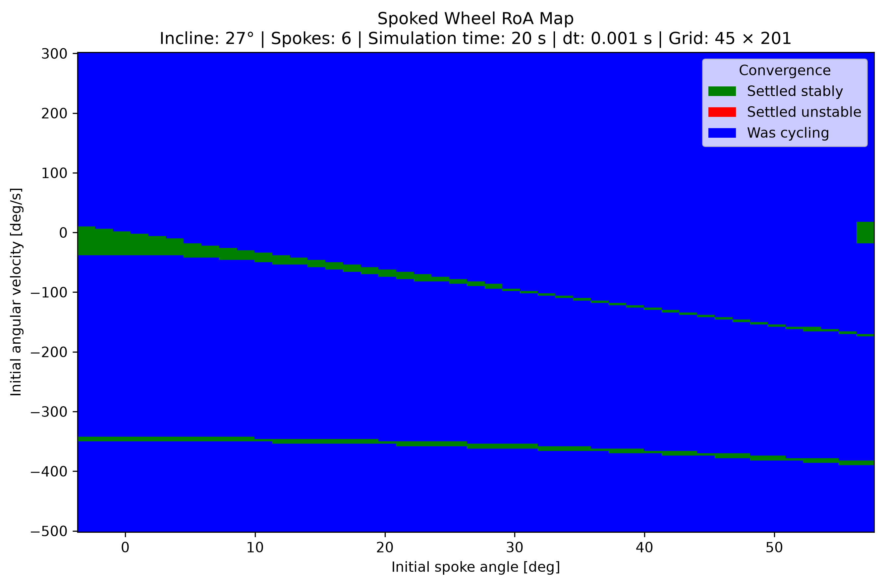

The initial state regions that settle to a stop become smaller and smaller as we increase inclination. My intuition for this is that as we make inclination higher, we need less energy to overcome stop conditions and start to limit cycle.  

___
#### Trying Different Numbers of Spokes
Increasing the number of spokes from 6 to 12 does increase the Floquet multiplier! My intuition here is that as we increase the number of spokes, the angle between them reduces, and so the momentum lost with each collision reduces as well (momentum retained is proportional to $\cos(2\alpha)$). So, the spoked wheel takes more collisions to slow to a stop. A higher Floquet Multiplier would correspond to more velocity retainment, and so it makes sense that Floquet Multiplier would increase with number of spokes.  
  
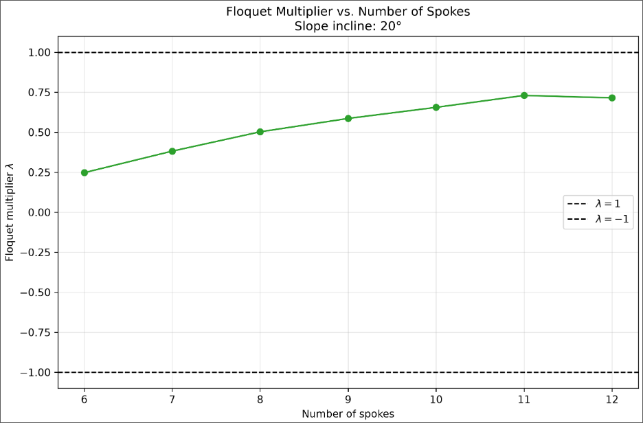

Looking at RoA graphs for different numbers of spoked wheels, we can see that the regions that converge to stopping shrink here as well, and the distance of the green bands to each other in velocity space seems to reduce too (which makes sense because angle between the wheels has reduced, so it takes less angle change to enter a duplicate initial state between two new legs).
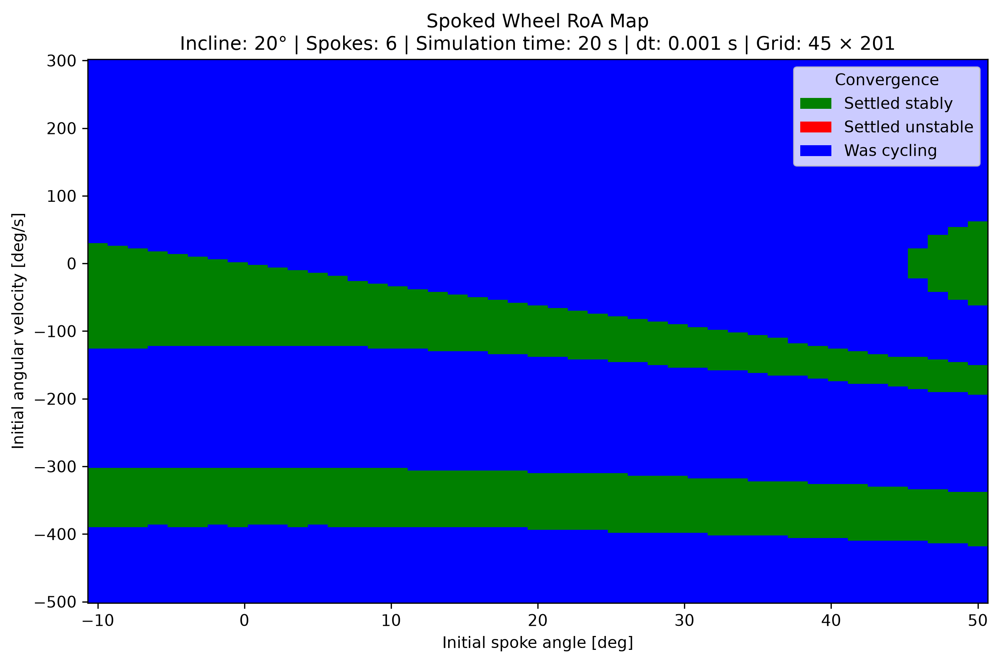
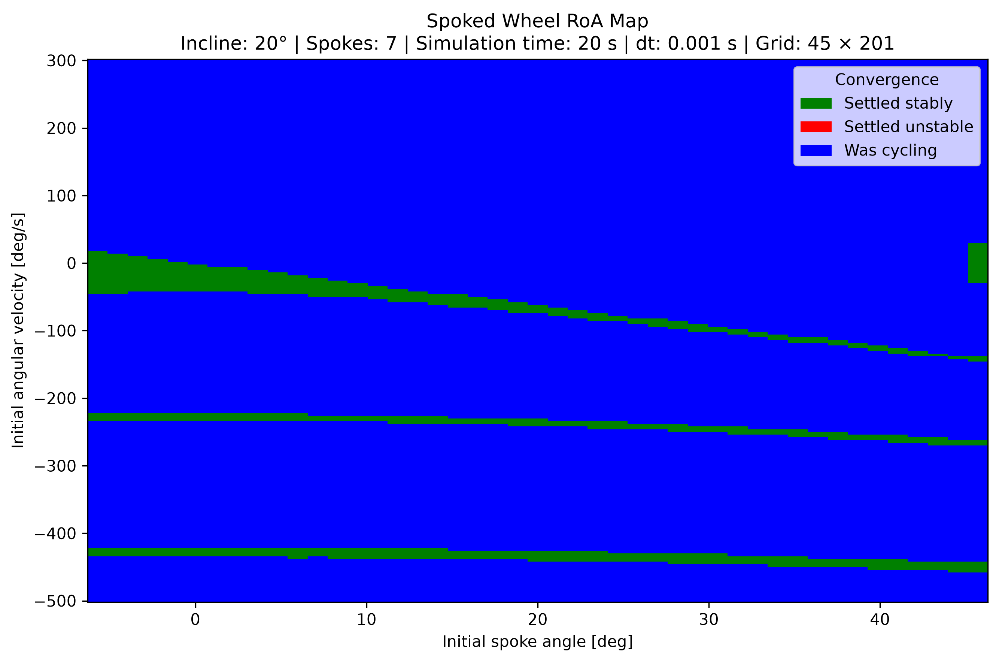

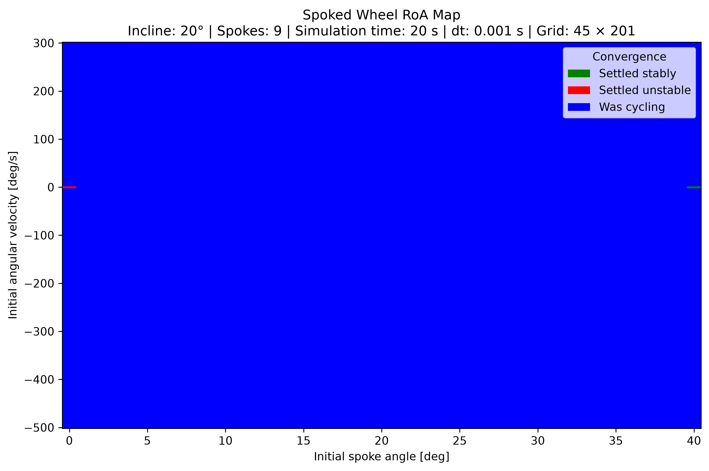

